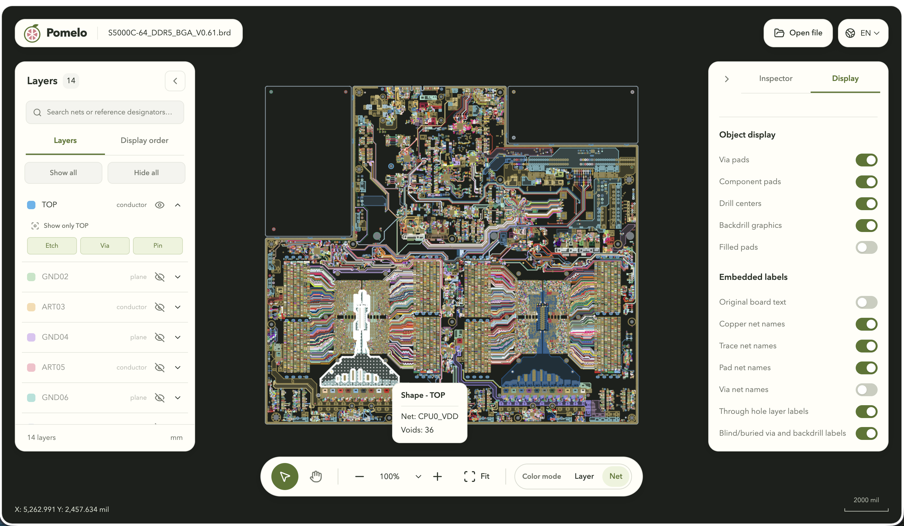

<p align="center">
  
</p>

<h1 align="center">Pomelo · PCB Viewer</h1>

<p align="center">
  <strong><a href="https://haiwenzhang.github.io/Pomelo/">線上使用 Pomelo</a></strong>
</p>

<p align="center">
  <strong>看清每一層，理解每一處連線。</strong><br>
  以 WebGPU 驅動的 PCB 檢視器，支援 Cadence Allegro、Altium Designer、ODB++、<br>
  PADS、Ansys HFSS 3D Layout 和 KiCad。在瀏覽器中探索電路板，檔案始終留在本機。
</p>

<p align="center">
  <a href="README.md">English</a> · <a href="REAME_cn.md">简体中文</a> · 繁體中文 · <a href="README_ja.md">日本語</a>
</p>

<p align="center">
  
  
  
  
</p>

<p align="center">
  <a href="#快速開始">快速開始</a> ·
  <a href="#支援的格式">支援的格式</a> ·
  <a href="https://github.com/HaiwenZhang/Pomelo/issues">問題回報</a> ·
  <a href="#參與貢獻">參與貢獻</a>
</p>



<p align="center"><em>從整板佈局，到一條線路、一個導通孔、一片銅箔。</em></p>

## 讓複雜電路板，更容易讀懂

有時，你只是想看懂一塊板：找到一個元件、追蹤一條訊號，或看看內層究竟如何佈線。Pomelo 將這些操作帶進清晰、專注的瀏覽器工作區，提供 **Cadence Allegro、Altium Designer、KiCad、PADS、ODB++ 和 Ansys HFSS 3D Layout** 格式匯入。

拖入檔案，顯示關心的圖層，點選查看連線。查看支援的檔案無需註冊帳號、上傳電路板檔案，也無需安裝原始 EDA 軟體。

- **設計留在本機。** 電路板檔案在瀏覽器內解析，不會上傳；查看過程不會修改原始檔案。
- **用 WebGPU 探索細節。** 幾何、板上文字和網路標籤透過 GPU 繪製，在同一畫面中查看線路、焊墊、導通孔與銅箔。
- **順著訊號看設計。** 按網路名稱或元件參考標號搜尋並定位，支援單一物件、整條線路、整個網路和元件的醒目提示。
- **讓密集布線清晰起來。** 按層或網路著色，單獨顯示指定圖層，調整顯示優先順序、銅箔透明度、焊墊填充與各類標注。
- **隨手檢查物件屬性。** 將游標移到物件上查看摘要，點選後在檢查器中查看屬性；選取線路或網路時可顯示佈線長度。
- **把空間留給電路板。** 可收起的側欄、緊湊的導航工具欄，以及英文 / 簡體中文 / 繁體中文 / 日文介面，讓瀏覽更順手。

> **專案處於早期開發階段：** 格式覆蓋和顯示精度仍在完善。Pomelo 是只讀查看器，不提供電路板編輯或 DRC，也不能替代原始 EDA 工具中的設計驗證。各格式的目前範圍見下表，具體匯入診斷可在介面的「檔案資訊」中查看。

## 支援的格式

目前提供以下匯入器。實際支援情況取決於檔案版本及包含的物件類型；接受某種副檔名，並不代表完整相容該格式。

| 來源                           | 檔案                      | 目前範圍與說明                                                                                 |
| ------------------------------ | ------------------------- | ---------------------------------------------------------------------------------------------- |
| **Cadence Allegro / 封裝佈局** | `.brd`、`.mcm`            | 線路、圓弧、焊墊、導通孔、銅箔、板上文字及已適配的封裝物件。二進位版本覆蓋與顯示規則仍在完善。 |
| **Altium Designer**            | `.PcbDoc`                 | 部分支援二進位檔案，包含線路、焊墊、導通孔、已儲存銅區和文字；其餘差異透過診斷提示。           |
| **KiCad**                      | `.kicad_pcb`              | 線路、焊墊、導通孔、板框和已儲存的銅區填充。暫不顯示板級文字、封裝圖形及文字，不重新鋪銅。     |
| **PADS**                       | `.pcb`                    | 部分支援二進位檔案中的連接關係、線路、焊墊、導通孔與銅箔。銅箔預覽需核對，暫不顯示圖形與文字。 |
| **ODB++**                      | `.tgz`、`.tar.gz`、`.tar` | 支援單個板級 step，暫不支援拼板 step-repeat 和負片層。                                         |
| **HFSS 3D Layout**             | `.def`                    | 匯入已適配的佈局幾何、圖層、網路與 Padstack；部分元件變換仍待驗證。                            |

`.brd` 匯入器面向 **Cadence Allegro 二進位檔案**，並非所有使用同名副檔名的 EDA 格式。

## 快速開始

### 環境要求

- 專案預設使用 **Bun** 管理依賴和執行開發腳本，儲存庫已包含 `bun.lock`。
- **Node.js 24.x**，供 JavaScript 工具鏈使用。也支援使用 npm 替代 Bun。
- 瀏覽器和顯示卡設備需要支援並啓用 **WebGPU**，且硬體加速可用。目前沒有 WebGL 回退方案。

### 本機執行

```sh
git clone https://github.com/HaiwenZhang/Pomelo.git
cd Pomelo
bun install --frozen-lockfile
bun run dev
```

打開 Vite 在終端中輸出的本機地址，通常為 [http://127.0.0.1:5173](http://127.0.0.1:5173)。等待 GPU 就緒後：

1. 點選「打開檔案」，或直接將支援的檔案拖入工作區。
2. 在「圖層」中單獨顯示關心的銅層，或將「配色」切換為「網路」，區分不同連接。
3. 搜尋網路名稱或元件參考標號，定位後透過懸停或點選檢查細節。

如果使用 npm，複製儲存庫後執行：

```sh
npm install
npm run dev
```

### 常用操作

| 操作         | 方式                             |
| ------------ | -------------------------------- |
| 縮放         | 滑鼠滾輪或工具欄縮放控制項       |
| 平移         | 在畫布上拖動，或按住滑鼠中鍵拖動 |
| 選擇 / 檢查  | 使用選擇工具點選物件             |
| 切換選擇工具 | `V`                              |
| 切換平移工具 | `H`                              |
| 整板適應視圖 | `F2` 或「適應」按鈕              |
| 清除選擇     | `Esc`                            |
| 切換介面語言 | 右上角語言選擇器                 |

如果 WebGPU 無法初始化，請檢查硬體加速，以及目前的瀏覽器、作業系統和顯示卡驅動是否支援 WebGPU。大檔案的載入與互動也受可用記憶體和顯示記憶體影響。

## 建置與開發

Pomelo 使用 **TypeScript、React、Vite、Tailwind CSS、Zustand 和 WebGPU / WGSL**。格式解析與幾何處理獨立於 React 介面，各匯入器透過統一的板圖模型連接渲染器。

```sh
bun run build       # 檢查應用類型並建置到 dist/
bun run preview     # 在本機預覽正式版本
bun run typecheck   # 檢查應用與測試程式碼的類型
bun run test        # 執行 Vitest 測試套件
```

使用 npm 時，將上述命令中的 `bun run` 替換為 `npm run` 即可。Bun 使用者請使用 `bun run test` 呼叫專案的 Vitest 測試腳本。

建置產物是靜態網站，可將 `dist/` 部署在網站根目錄並透過 HTTPS 瀏覽，本機查看可使用 localhost；WebGPU 需要安全的執行環境。無需提供處理電路板檔案的後端服務。

文字的字形來自 Adobe 的 **[Source Han Sans SC（思源黑體簡體中文）](https://github.com/adobe-fonts/source-han-sans)**，遵循 [SIL OFL 1.1](public/fonts/source-han-sans/LICENSE.txt) 授權。**Pomelo Sans** 是本專案為產生的字型子集選定的內部字型家族名稱，字形設計仍歸屬於 Adobe 的思源黑體。原授權將 **Source** 宣告為保留字型名稱（Reserved Font Name）。本專案裁剪字元集並預先產生 WOFF2 子集，這些子集屬於修改版本，受 OFL 第 3 條的保留名稱限制，因此產生的字型採用不同的家族名稱，並保留 Adobe 的版權聲明與原 OFL 授權。詳見 [OFL 官方對 Web 字型與保留名稱的說明](https://openfontlicense.org/webfonts-and-reserved-font-names/)。

板上文字和自動標籤共用 MSDF 渲染。首次載入英文、數字和常用工程符號的圖集；其他字形按每區塊 256 個碼點的 Unicode 區塊，僅在板上文字或網路名稱使用時按需載入。Web 介面字型使用可變 WOFF2 子集，透過 CSS `unicode-range` 宣告涵蓋範圍。瀏覽器不會載入完整的 OTF 字型。

| 目錄                               | 職責                               |
| ---------------------------------- | ---------------------------------- |
| [`src/app`](src/app)               | 工作區組合與渲染器生命週期         |
| [`src/components`](src/components) | 圖層、搜尋、檢查器和顯示控制       |
| [`src/lib`](src/lib)               | 各格式匯入器、互動與幾何處理       |
| [`src/lib/board`](src/lib/board)   | 統一板圖模型與顯示邏輯             |
| [`src/lib/render`](src/lib/render) | WebGPU 渲染器與 WGSL 著色器        |
| [`src/i18n`](src/i18n)             | 英文、簡體中文、繁體中文與日文資源 |
| [`tests`](tests)                   | 解析、幾何、渲染與互動測試         |

## 參與貢獻

一起讓更多電路板變得容易探索。歡迎參與格式相容、渲染精度、大板性能、翻譯與文件改進。

- **遇到匯入或顯示問題？** 請[提交 Issue](https://github.com/HaiwenZhang/Pomelo/issues)，附上來源軟體及檔案版本、瀏覽器 / 作業系統 / GPU 資訊、重現步驟與匯入診斷。可公開的小型範例或原始軟體對照截圖尤其有幫助，分享前請移除機密設計資料。
- **準備提交改進？** 解析器或幾何變更請附上針對性的回歸測試，視覺變更請提供截圖；涉及已記錄行為的調整，請同步更新四種語言的 README。
- **覺得 Pomelo 有幫助？** 歡迎按下 Star，也可以分享給經常需要查看 PCB 的朋友。實際使用回饋能幫助專案確定下一步相容性改進的優先順序。
